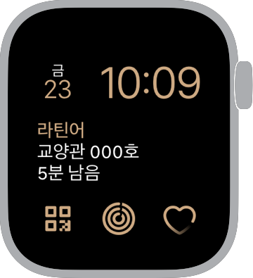
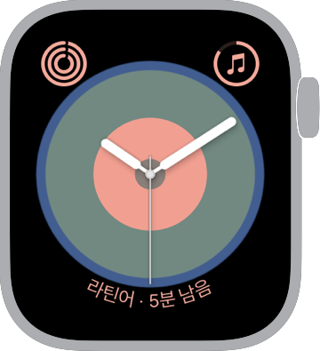
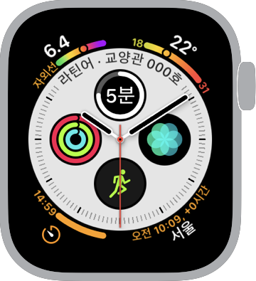
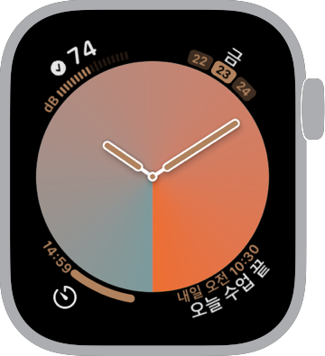
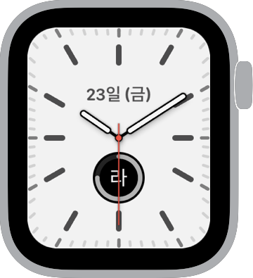
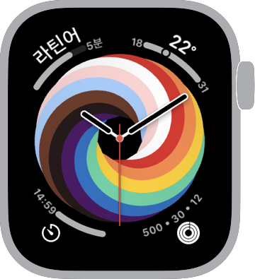

import AddToAppleWatchButton from "./add-button/index.tsx";
import "./index.scss";

# HeekTime 페이스 갤러리

HeekTime에서 제공하는 컴플리케이션에 대해 알아보세요. 또는 추가 버튼을 눌러 컴플리케이션이 적용된 페이스를 바로 적용할 수도 있습니다.

 

## 현재 강의 컴플리케이션

현재 강의 혹은 다음 강의 정보와 남은 시간을 표시합니다.

<AddToAppleWatchButton href="/files/모듈.watchface" className="add-button" />
 

<AddToAppleWatchButton href="/files/만화경.watchface" className="add-button" />
 

<AddToAppleWatchButton
  href="/files/인포그래프.watchface"
  className="add-button"
/>
 

<AddToAppleWatchButton
  href="/files/그라디언트.watchface"
  className="add-button"
/>
 

<AddToAppleWatchButton
  href="/files/캘리포니아.watchface"
  className="add-button"
/>
 

<AddToAppleWatchButton
  href="/files/프라이드-우븐.watchface"
  className="add-button"
/>
