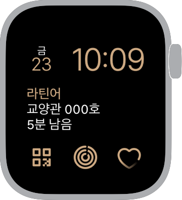

<Layout>

# Apple Watch 지원

안녕하세요, HeekTime 3.5.0 버전부터 Apple Watch를 지원합니다. Apple Watch용 HeekTime은 iOS 앱과 함께 사용할 수 있습니다.

 

### 컴플리케이션

애플 워치 페이스에서 사용할 수 있는 현재 강의 정보 컴플리케이션을 제공합니다.
현재 강의 컴플리케이션은 현재 진행 중인 수업 정보와 남은 시간 또는 예정된 수업에 대한 정보를 보여줍니다.

<Link to="/contents/watch-faces">페이스 갤러리</Link>에서 컴플리케이션을 살펴보고
예제 페이스를 바로 적용해보세요.

 
 

### Watch 앱

Watch 앱에서는 간단히 시간표를 조회할 수 있습니다.

 

문의: <a href="mailto:heektime@heek.kr">heektime@heek.kr</a>

</Layout>
